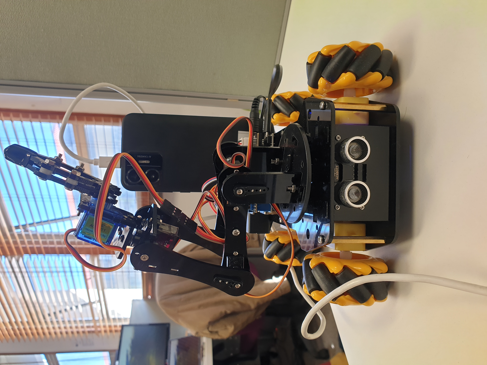

  
# Autonomous Object-Seeking Robot using Smartphone for Vision and Control

## Android Application
### Classes
- [MainActivity.kt](My-Camera-Capture-App/app/src/main/java/com/example/myapplication/MainActivity.kt)
- [CharSender.java](My-Camera-Capture-App/app/src/main/java/com/example/myapplication/CharSender.java)

## Robot Program
[move-to-and-pick-up-block.py](Robot code/move-to-and-pick-up-block.py)

